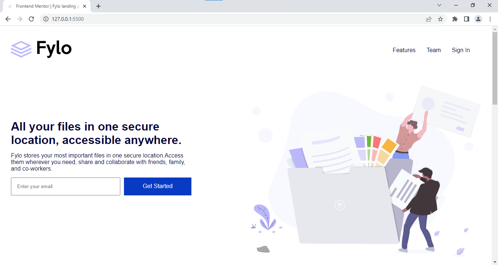

This is a solution to the [Results summary component challenge on Frontend Mentor](https://www.frontendmentor.io/challenges/fylo-landing-page-with-two-column-layout-5ca5ef041e82137ec91a50f5). Frontend Mentor challenges help you improve your coding skills by building realistic projects. 

## Table of contents

- [Overview](#overview)
  - [The challenge](#the-challenge)
  - [Screenshot](#screenshot)
  - [Links](#links)
- [My process](#my-process)
  - [Built with](#built-with)
- [Author](#author)

## Overview

### The challenge

Users should be able to:

- View the optimal layout for the interface depending on their device's screen size
- See hover and focus states for all interactive elements on the page

### Screenshot

### Links

- [Repo URL](https://github.com/Ajayfrizzy/fylo-landing-page.git)
- [Live site URL](https://ajayfrizzy.github.io/Fylo-Landing-Page/)

## My process

### Built with

- Semantic HTML5 markup
- CSS3 Properties
- Flexbox
- Mobile-first workflow
- Google Font
- Fontawesome
- CSS Variable

## Author
- Frontend Mentor - [@Ajayfrizzy](https://www.frontendmentor.io/profile/Ajayfrizzy)
- Twitter - [@Ajayfrizzy](https://www.twitter.com/Ajayfrizzy)
